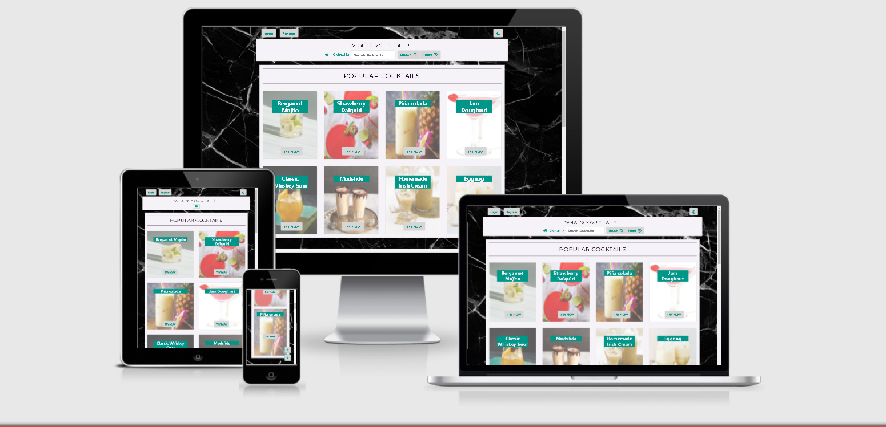

<h1 align="center" id="your-tail">What's your tail?</h1>

See the current [Deployed Version](https://whats-your-tail.herokuapp.com/) of the app.

---
## README Sections 
<a href="#ux">User Experience</a>  

<a href="#features">Site Features</a>  

<a href="#tech">Incorporated Technologies</a>  

<a href="#test">Testing</a>  

<a href="#deploy">Deployment</a>  

<a href="#credits">Credits</a>

---

<h2 align="center">An Introduction</h2> 

We've all had those long days or weeks at work where it get's to 4 o'clock and we're staring at the clock thinking 
about what beverage we're going to treat ourselves to when we get home. We all know it's naughty, and definitely not 
good for our bodies if not enjoyed in moderation- but that doesn't stop us from wanting to partake on a journey of creativity 
and discovery when it comes to enjoying a nice cold beverage after a hard day in the office.

What's your tail? Is a website built around Cocktails, a centre for people to express their creativity and share their ideas 
and recipes with a like-minded community. Whether you want some inspiration, or you want to inspire others with a mouthwatering 
concoction of your own discovery or creation- this is the place to be!

What's your tail is my third Milestone project for submission to the Code Institute Full Stack Web Development Diploma that 
I am currently enrolled as a student on. 

---

<h1 id="ux" align="center">User Experience</h1>

## Project Criteria 
- Design and make a website using HTML, CSS, JS/jQuery, Python+Flask and MongoDB.
- Fully incorporate CRUD functionality within the site.
- Allow users to manage and edit a common dataset.

## Specific Site Goals 
- Create a site that allows users to add, update, and delete their own recipes from the recipe.
- Allow users to like other users recipes.
- Make the site easy and intuitive to navigate and use.

## Website User Stories 

#### First Time User Goals:
- As a first time user, I want to be able to easily search for recipes based on keyword ingredients I would like to use. 
- As a first time user, I want to see a selection of recipes to easily browse through for inspiration.
- As a first time user, I want to be able to easily use the site regardless of the device being used to access it. 
- As a first time user, I want to be able to select specific categories of recipes. For example, Alcohol or Non-Alcoholic Mocktails.
- As a first time user, I want to be able to register for an account and contribute my own recipes.
- As a first time user, I want to be able to intuitively use the site and navigate to specific areas.  

#### Registered Account Goals:
- As a registered user, I want to be able to share my recipes with the website for other users to enjoy.
- As a registered user, I want to be able to modify or delete my recipes.
- As a registered user, I want to be able to easily login to and manage my account. 
- As a registered user, I want to be able to sign out of my account with ease.
- As a registered user, I want to be able to like other recipes that I have enjoyed or wish to try. 

#### Admin Account Goals: 
- As the admin user, I want to be able to delete any recipes that do not fit with the site theme of Cocktails.
- As the admin user, I want to be able to add new categories of Cocktails.
- As the admin user, I want to be able to remove any categories that do not serve a purpose. 
- As the admin user, I want to be able to remove any accounts that do not adhere to posting the correct content. 

## Design

#### Colour Scheme 
I used the [Coolors](coolors.co) to search for different colours to use within the app. Here is a list of the colours and their respective hex codes:  
- #009688 :  Shade of Green
- #F5F3F7 : Offshade of White/Gray
- #D7D6D6 : Lighter Shade of Gray
- #A1A1A5 : Darker Shade of Gray
- #210124 : Lighter Shade of Black

I also decided to include a light and dark mode using Black and White Marble Images. The idea is that it would
give the website a bar vibe and fit with the app focus of Cocktails.

#### Typography  
The fonts used within the app are all from the [Google Fonts Library](https://fonts.google.com/). Within this project I
used [Yomogi](https://fonts.google.com/specimen/Yomogi?query=yomo), [Tourney](https://fonts.google.com/specimen/Tourney?query=tourn), and [Montserrat](https://fonts.google.com/specimen/Montserrat?query=montserrat). The default backup font
is sans-serif.

#### Icons 
In this project, I will use the Font Awesome Library due to the wide variety of icons it offers. You can take a look at their library [here](https://fontawesome.com/)

#### Images 
Due to users being able to use images URL's when creating their own recipes, Images will come from a variety of sources in the end. 
However, I will use the recipe images from [bbcgoodfood.com](https://www.bbcgoodfood.com/) for this project as the majority of cocktail recipes have been sourced from there. Any additional credits will be listed in the credits section. It also 
worth noting that the backgrounds for Light/Dark mode will be image based as mentioned above.

## Wireframes 

You can see the original Wireframes [here](/docs/wyt-wireframes.pdf), I decided to make a dedicated PDF so as not to overfill
this document. Obviously since originally designing them the site has evolved and changed out of 
necessity due to knowledge of implementation and time scales available to work with. The main differences
are:

**base.html**:
    - Login/ Logout/ Register is not contained within the main navigation. To make it standout and be easily accessible
    they are contained within buttons floating above the main navigation.
    - Copyright is not within a footer column, instead it sites underneath it within a single line.

**home.html**:
    - The only difference from the wireframe design is that there is not a jump to cocktails button within the section and 
    the card design is full image with a text and button overlay. Because every card has a CTA to specific Cocktails, I decided that another one was not needed given the ease of navigation already within the site.

**cocktails.html**:
    - Unlike the wireframe, I decided to hold off adding Pagination to the Cocktails until a later release. There were a 
    variety of reasons for this decision. Firstly, I didn't think there were enough Cocktails uploaded to the site yet to justify adding Pagination. Secondly, because all of the content is relatable, I deemed a little scrolling with the aid
    of top/bottom buttons to be more than justifiable/acceptable. The third factor was the amount of time I was left with to complete the first release of this project. Due to current neurological issues, I wanted to finish the first release without adding too much extra stress/pressure within the timeframe left.
    - In the wireframe, I had originally planned to add a dropdown menu to select a cocktail category. Instead I opted for
    Category Buttons to show the user all cocktails from specific categories. There wasn't any huge factor in this decision, I simply preferred the way it blended with the pre-existing design at that point in development. I may change this later should it no longer continue to suit the functionality of the site as it evolves and content grows.

**cocktail-recipe.html**:
    - The wireframe is almost the same, other than the fact that I decided to have a squared image with the image in one column and all of the text in another.  

**profile.html**:
    - I decided to scrap the profile image and bio for a number of reasons. Firstly, only the logged in user can see
    see the profile- so it didn't seem like there was any reason to have this. Secondly, the site is not a social media platform- the only posts within the site are Cocktail Recipes.
    - I didn't implement a Like System for individual recipes. I decided it would be too time consuming for now, and instead
    decided to allow users to show their love for the app. I plan to implement a like system for individual recipes within a future release.
    - The users recipes are displayed as cards like the rest of the app.
    - The Liked Recipes area will be installed on a future release when the system is implemented.

**add-cocktail.html/edit-cocktail.html**:
    - The original plans for these form based pages are exactly the same as the wireframes.

**user-recipes.html**:
    - The concept for this page is mostly the same, however instead of using cards, I used the 
    Bootstrap Collapse component to allow the user to click on recipe names to access the chosen recipe 
    and then View, Edit or Delete them.  
    

**Categories.html**:
    - The Manage Categories Page has a Bootstrap Dropdown Component as it's base as planned- You can
    click the Category name and then Buttons will appear giving the admin the option to Edit or Delete 
    the chosen category.
    - The only difference to the wireframe is that I added a box above the Manage Categories area to quickly 
    add new categories.

All of the wireframes are the same as the original wireframes but using a single column from the Bootstrap 
Grid.

## Extra Installations Since Wireframes  

**promotions.html**:  
    - A place the admin can view all of the email addresses that have signed up for promotional news.

    INSERT SCREENSHOT

**users.html**:
    - A place the admin can view the app users, and remove any users that don't adhere to the websites
    standards.

    INSERT SCREENSHOT

**error 404**:
    - I have decided I will add an error page. I will make this fit with the design of the pre-existing site and 
    offer users a link back to the homepage when they land there.  

    INSERT SCREENSHOT

## Information Architecture   

The What's Your Tail Database has 5 Collections in the database, some of these Collections have identical keys. To show
within the tables which keys are identical I will label them with *Italic*. Take a look at the database tables
below:  
  
**Recipes Collection**

|Key | Value | Type|
|--- | --- | ---|
|*_id* | Unassigned | ObjectId|
|*category_name* | Unassigned | String|
|recipe_name | Unassigned | String|
|prep_time | Unassigned | String|
|img_url | Unassigned | String|
|ingredients | Unassigned | Array|
|garnish | Unassigned | String|
|method_step_one | Unassigned | String|
|method_step_two | Unassigned | String|
|inspiration | Unassigned | String|
|method_step_one | Unassigned | String|
|eat_with | Unassigned | String|
|author | Unassigned | String|
|created_by | Unassigned | String|`

**Categories Collection**  

|Key | Value | Type|
|--- | --- | ---|
|*_id* | Unassigned | ObjectId|
|*category_name* | Unassigned | String|

**Loved Collection**  

|Key | Value | Type|
|--- | --- | ---|
|*_id* | Unassigned | ObjectId|  
|loved_by | Unassigned | String|

**Promotions Collection**  

|Key | Value | Type|
|--- | --- | ---|
|*_id* | Unassigned | ObjectId|
|email_address | Unassigned | String|  

**Users Collection**  

|Key | Value | Type|
|--- | --- | ---|
|*_id* | Unassigned | ObjectId|
|username | Unassigned | String|
|password | Unassigned | String|
|is_admin | False | Boolean|  

As you can see- all of the collections have an _id, This acts as a key for accessing specifc data. The Recipes and Categories
Collections both have the *category_name* key.

<h1 id="features" align="center">Site Features</h1>

## Current App Features 

### General Features
- A crisp and simple design, easy for the user to understand.
- The Cocktails are showcased simply on the homepage and it's own page, and are easy to explore using the
categorised buttons or the search functionality.
- The site is easy to navigate using the Navigation system, Call to Action buttons and the Top/Bottom floating
buttons.
- The site provides a light/dark mode for viewing in whichever is preferable to the user.
- CRUD Functionality
    - Users can Sign Up, Sign In, Logout, Upload Cocktails, Edit their Cocktail Recipes, Read uploaded Cocktails and Delete their Accounts/ Recipes.
    - The admin can do all of the above, Aswell as Add/Edit/Delete Categories, Remove Users, View Promotions info etc.

### Page Features & Functionality  

- **Base.html**
    - Navigation
        - Search All Cocktails in Database using keywords.
    - Footer
    - Top/Bottom Buttons

- **Homepage**
    - Love This Site
    - Sign up for Promotions
    - Shop Now
    - Popular Cocktails
    - Social Media Links  

- **Cocktails**
    - All Cocktails
    - Category Buttons for Cocktails  

- **Register/Login/Logout**
    - Sign up to app.
    - Login to website with user credentials.
    - Logout of website and return to login page.  

- **My Profile**
    - My Uploaded Cocktails
    - Deativate My Account

## Admin Page Features & Functionality
- **Manage Categories**
    - View, Edit Or Delete existing categories.
    - Add new category  

- **Manage Users**
    - View existing users
    - Remove users  

- **Promotions List**
    - View email addresses of people who have signed up for promotions.  

- **Manage Cocktail Recipes**
    - View, Edit and Delete existing Cocktails.

## Features To Implement Later
- **Cocktails Pagination**
    - Originally I planned to include this straight away, but after much reading and not having enough Cocktails on the
    App yet for it to seem worthy to invest time in pagination I decided to go with a top/bottom button for the time being
    until there is more Cocktails included within the app. This decision was made due to timings and the fact that all of 
    the site content is relatable so therefore easy to scroll through. When a user needs a specific recipe, the search function is available and easily accesible using the 'Back to top' button.  

- **Upgrade Promotions Feature**
    - Long term, make it so the site automatically responds to the email address users sign up. There could also be 
    more useful expansions to be added at a later date should they become relevant to the sites requirements.  

- **Add change username option**
    - I think this would be a cool feature to have, as I often find myself wishing I could change my username 
    after making one.  

- **Add ability to change password**
    - For security purposes, being able to change your password as often as needed is something that I think 
    should become a priority for a future release. Obviously at the moment, the site doesn't hold any sensitive
    data- but this could change as the site grows.  

- **Upgrade the love/like system to individual recipes**
    - Originally I aimed to incorporate a like system for individual recipes, but due to the amount of 
    time I was left to work with I decided to compromise and have a love button for the website in general
    and then expand on it within a later release.  

- **Upgrade the Bottom button to vanish when close to footer**
    - This is something I need to look more into at a later date. I'm currently unsure of how to make this happen
    but will only need to take the concept further if pagination is not added into the second release as i believe
    this would take away the need for the facility. 

<h1 id="tech" align="center">Incorporated Technologies</h1>  

## Languages Used  
- [HTML5](https://html.spec.whatwg.org/)
- [CSS3](http://www.w3.org/Style/CSS/Overview.en.html)
- [Javascript](https://www.javascript.com/)
- [Python3](https://www.python.org/download/releases/3.0/)

## Frameworks, Libraries & Resources Used  
- [Bootstrap](https://getbootstrap.com/)
- [Flask](https://flask.palletsprojects.com/)
- [Jinja 2](https://palletsprojects.com/p/jinja/)
- [Google Fonts](https://fonts.google.com/)
- [Font Awesome](https://fontawesome.com/)
- [jQuery](https://jquery.com/)
- [MongoDB](https://account.mongodb.com/)
- [Heroku](https://id.heroku.com/login)
- [Werkzeug](https://werkzeug.palletsprojects.com/)
- [Google Fonts](https://fonts.google.com/)

## Testing Tools & Utilities  
- [W3C HTML Validator](https://validator.w3.org/)
- [W3C CSS Validator](https://jigsaw.w3.org/css-validator/)
- [JShint Javascript Validator](https://jshint.com/)
- [PEP8 Python Validator](http://pep8online.com/)
- [Google Chrome Dev Tools](https://developer.chrome.com/docs/devtools/)
- [Am I Responsive?](http://ami.responsivedesign.is/)

<h1 id="testing" align="center">Testing</h1>  

## Validation Results  

Here are a list of the validation results:
- **HTML Fixes**:
    - [Error/Warning Logs](https://validator.w3.org/nu/?showsource=yes&doc=https%3A%2F%2Fwhats-your-tail.herokuapp.com%2F)
        - Bad value submit for attribute type on element a: Subtype missing.
            - Easy fix, type=submit removed from anchor element.
        - Section lacks heading. Consider using h2-h6 elements to add identifying headings to all sections.
            - This Section is used to display Flash Messages, as a quick fix I will change the element from a Section
            tag to a Div.
        - Duplicate ID warnings are irrelevant because they're only repeated by Jinja Templating and are not actively
        repeated within the written HTML code.
        - Stray End Div Tags removed.
        - Closing Footer Tag exists and functions.
    
    All HTML fixes acted upon should display after the 'HTML Validation Fixes' commit.  

- **CSS Fixes**:  
    - [Error/Warning Logs](https://jigsaw.w3.org/css-validator/validator?uri=https%3A%2F%2Fwhats-your-tail.herokuapp.com%2F&profile=css3svg&usermedium=all&warning=1&vextwarning=&lang=en)
        - There are no entrys I am concerned about within these logs, the majority is based upon external code or simply
        created CSS variables that the validator doesn't recognise used for the light/dark mode CSS rules.  

- **Javascript Fixes**:
    - up-down.js:
        - I originally had a topFunction() and bottomFunction() within this file but have commented it out and found
        the functionality works exactly the same without it- This will be removed before final deployment and submission.
        - There was an unused 'let footer' variable, this will also be removed.  
    - main.js:
        - Unused jQuery Code from Line 29 - 55 commented out, tested delete functionality without and all functioning
        perfectly- Therefore this will be removed before final deployment and submission.  
    - light-dark.js:
        - No issues that need addressing.
    
    Any JShint warnings that haven't been addressed were because they didn't pose a threat to the functionality 
    or operation of the app.

- **PEP8**:
    You can see the PEP8 Validation results [here](/docs/pep8-validator-results.txt).

## Testing the App 

### Site Responsiveness  

I used the Google Chrome Dev Tools throughout the design of this site in conjunction with the Am I Responsive? Website
facility. The site has been built using Bootstrap and it's Grid Facility as a base to make sure that it's functional across
multiple devices.

Checkout how the app looks across multiple devices [here](http://ami.responsivedesign.is/?url=https%3A%2F%2Fwhats-your-tail.herokuapp.com%2F).

### Testing User Stories  

#### First Time User Goals:
- As a first time user, I want to be able to easily search for recipes based on keyword ingredients I would like to use. 
    - As soon as arrive on the site there is a search bar on/within the site navigation. If you're on mobile
    you just have to press the menu bars to access this.
- As a first time user, I want to see a selection of recipes to easily browse through for inspiration.
    - Straight away on the homepage you are greeted by the 'Popular Recipes' section.
    - Within the navigation you can search for Cocktails using keywords.
    - The Cocktails page is the also within the site navigation, where you can access all cocktails- or choose
    to see Cocktails within a certain category using the cocktail category buttons.
- As a first time user, I want to be able to easily use the site regardless of the device being used to access it. 
    - The website is made using the Bootstrap Grid, so is optomised to be viewed on all devices.
- As a first time user, I want to be able to select specific categories of recipes. For example, Alcohol or Non-Alcoholic Mocktails.
    - As mentioned, on the Cocktails page you can select Cocktails by the category they're in using the category buttons.
- As a first time user, I want to be able to register for an account and contribute my own recipes.
    - At the top of every page sits the 'Register' button, so users can easily sign up for an account and add their 
    own recipes.
- As a first time user, I want to be able to intuitively use the site and navigate to specific areas.  
    - The site is easy to navigate through using the navigation bar, top/bottom buttons and search facility.

#### Registered Account Goals:
- As a registered user, I want to be able to share my recipes with the website for other users to enjoy.
    - Registered users can easily share recipes by selecting the 'My Account' dropdown within the navbar and
    then selecting 'Add Cocktail'.
- As a registered user, I want to be able to modify or delete my recipes.
    - Registered Users can modify their recipes by selecting 'My Account', selecting 'My Profile' and 
    then click on the recipe they wish to 'Edit' or 'Delete' and click the relevant button on the recipe page.
- As a registered user, I want to be able to easily login to and manage my account. 
    - Above the Navbar, the Login button sits. Just click it, and you're taken to the Login page. To manage your
    account, just click 'My Account' once logged in.
- As a registered user, I want to be able to sign out of my account with ease.
    - As a logged in user, The Logout button sits above the navbar where the Login button rests when a user
    is not signed into an account. Just click it to Logout from the app.
- As a registered user, I want to be able to like other recipes that I have enjoyed or wish to try.
    - Due to the amount of time left to implement this site and personal illness, I decided to do a temporary
    workaround and allow users to 'Show Love' for the website instead of individual recipes. This feature will
    be upgraded to the original plan in a later fix.

#### Admin Account Goals: 
- As the admin user, I want to be able to delete any recipes that do not fit with the site theme of Cocktails.
    - As the admin, simply click on 'My Account' and select 'Manage Recipes'. From this page you can select
    specific recipes and choose whether to 'View', 'Edit' or 'Delete' them.
- As the admin user, I want to be able to add new categories of Cocktails.
    - As the admin, Select 'My Account' and then select 'Manage Categories'. At the top of the page, you can
    easily add a new category by simply typing in the chosen name and selecting submit.
- As the admin user, I want to be able to remove any categories that do not serve a purpose.
    - As the admin, Select 'My Account' and then select 'Manage Categories'. Select the Category name you wish
    to remove and then press the 'Delete' button within the modal.
- As the admin user, I want to be able to remove any accounts that do not adhere to posting the correct content. 
    - As the admin, Select 'My Account' then select 'Manage Users'. Once on the page, just select the User you wish
    to remove, press the 'Delete' button and then confirm you wish to delete their account. Done!

### User Experience Survey   

As part of my plan to receive ongoing feedback and inspiration for evolving the website, I decided to make a User
Survey so that I can assess the feedback before each new release and add in any fixes or ideas that are most popular
or deemed needed by the Users.

I asked the following questions:
- What is your favourite thing about the app?
- What would you suggest changing on the app?
- What would you like to see added to the app?
- Were there any issues or bugs you found when using the app?
- Would you use the app again?

I will review the results as part of the planning for the second release. If you wish to see the results, you 
can [take the survey](https://surveyheart.com/form/60db46779397ef55ba5d2a5e) now.

### Defensive Design  

To make sure that Defensive Design is included, I have used the 'required' attribute on all forms. I have also used
the CSS 'pattern' attribute on relevant form inputs, the HTML type attribute is used throughout, and I have collectively checked that all buttons are functioning and serve a purpose. 

### Bugs Solved  

- I initially found a bug between the way recipes would display slightly differently depending on how they were input. 
I found that this was down to whether they were input from the backend or the frontend and used a workaround by asking 
the user to input the ingredients into the form using commas and a full stop at the end fixed this.

- I lost my env.py file at one point due to a Gitpod shutdown, I simply resolved this by reinstalling my Procfile, requirements.txt and rewriting the env.py- everything worked fine again after that. I also pinned my workspace at the
recommendation of GitPod and have had no issues with this since.

### Browser Compatibility  

The site has been tested within Google Chrome and Microsoft Edge/Internet Explorer and works without any issues.

<h1 id="deploy" align="center">Deployment</h1>

The master branch of this repository is the most current version and has been used for the deployed version of the site.

## Essential Requirements  
- [GitHub Account](https://werkzeug.palletsprojects.com/)
- An IDE that Supports Python3 for the core code.
- PIP for package installation.
- Git for version control.
- [MongoDB Account](https://account.mongodb.com/)  
    - MongoDB is the database that the users will store all of the data they create in the app within.
    - These Collections should be created within the cluster that will be used for the app:
        - Categories
        - Recipes
        - Users
        - Promotions
        - Loved
    - A document within Recipes should be created using the following fields:  

        |Key | Value | Type|
        |--- | --- | ---|
        |category_name | Unassigned | String|
        |recipe_name | Unassigned | String|
        |prep_time | Unassigned | String|
        |img_url | Unassigned | String|
        |ingredients | Unassigned | Array|
        |garnish | Unassigned | String|
        |method_step_one | Unassigned | String|
        |method_step_two | Unassigned | String|
        |inspiration | Unassigned | String|
        |method_step_one | Unassigned | String|
        |eat_with | Unassigned | String|
        |author | Unassigned | String|
        |created_by | Unassigned | String|

    - The MongoDB Cluster is apart of the AWS EU/Ireland Package. You can find out more [here](https://aws.amazon.com/)

- [Heroku Account](https://heroku.com)
    - See below for more information on how to deploy the app to Heroku.

## To Clone This App  

**To make your own local clone using GitHub Desktop, please follow these steps:**   
1. Log in to your [GitHub Account](https://github.com/) and go to this [repository](https://github.com/jakelashbrook/cocktails-ms3).
2. Click on the Grey Button in the top right corner of the page with the text “Code” just left of the Green Gitpod button.
3. Next click on the “Open with GitHub Desktop”  option and follow the prompts in the GitHub Desktop Application to clone the app.

## Work with the Local Copy  

**To make your own local copy using HTTPS, please follow these steps:**   
1. Log in to your [GitHub Account](https://github.com/) and go to this [repository](https://github.com/jakelashbrook/cocktails-ms3).
2. Click on the Grey Button in the top right corner of the page with the text “Code” just left of the Green Gitpod button.
3. In the Clone area select HTTPS the option, copy the clone URL for the repository.
4. In your chosen IDE, Open Git Bash.
5. Change the current working directory to the location where you would like the cloned directory to be stored.
6. Type git clone, and then paste the URL you copied in Step 3.
7. Now press Enter and your local clone should have been created.
8. Create a file called env.py to hold your app's environment variables, which should contain the following:
        import os

        os.environ.setdefault("IP", "0.0.0.0")
        os.environ.setdefault("PORT", "5000")
        os.environ.setdefault("SECRET_KEY", "<app secret key>")
        os.environ.setdefault("MONGO_URI", "mongodb+srv://<username>:<password>@<cluster_name>-ofgqg.mongodb.net/<database_name>?retryWrites=true&w=majority")
        os.environ.setdefault("MONGO_DBNAME", "<database name>")
9. It's vital to make sure that your Environment Variables are not pushed to GitHub so that the app's security is not
compromised! Double check you have included your env.py file within the .gitignore file before making any commits to Git.
10. If all the above steps have been followed correctly, you should now be able to run the app using this CLI Command:  

        python3 app.py

## How to Deploy to Heroku  
1. First things first, you should set up a local workspace at [Heroku.com](https://heroku.com).
    - In the terminal view of your chosen IDE, type: **pip3 freeze -- local > requirements.txt**. By typing this 
    command Heroku will know which files to install from your local development environment.
    - Aswell as the requirements.txt file, you will also need to create a Procfile. Heroku will use this file 
    as a kind of gateway to your project. In the terminal of your IDE, type: **python app.py > Procfile**. This 
    command will create the Procile for you.

Make sure that you push these files to your master branch so that they can be accessed by the Heroku app when it's
set up.

2. Now that you've set up your requirements.txt and Procfile, you need to set up your Heroku account (if you don't 
already have one). Inside your account, Create an app and then select the appropriate region relevant to your location.

3. Next we will deploy our GitHub Branch to Heroku which will host our app for us, however unlike Gitpod- Heroku will
only host the code that has been committed to the branch and not any code that is within the Gitpod workspace but uncommitted
to the master branch. 
    - Under the **Deploy** Tab at the top of the page, scroll down and within the **Deployment Method** area, 
    select **GitHub**.
        - Once selected, search the appropriate repository that you wish to connect to Heroku. When it appears,
        click **Connect** and Heroku will start automatically deploying the master branch as a Heroku app.

4. Now that the app is connected to the relevant repository, we need to set up some important Configuration Variables.
Click on the **Settings** Tab at the end of the App Nav, And then scroll down to the **Config. Vars** area and select
**Reveal Config Vars**. Inside this area you will enter the appropriate variables from your **env.py** file, these 
will include the keys named **IP, PORT, SECRET_KEY, MONGO_URI, MONGO_DBNAME**, you will need to supply the values.

5. Once all of these steps have been taken, we can now set up **Automatic Deployment** so Heroku will automatically 
check for updates to the master branch and update the Heroku App. Head back to the **Deploy** tab and select the 
**Automatic Deploys** area, and then click the **Enable Automatic Deploys** button. 

6. If you scroll down to the bottom of the **Deploy** Tab you will also notice an option for **Manual Deploy**.
Click the **Manual Deploy** Button and it will start building your app. I find it often useful to do a Manual Deploy
after any big pushes containing lots of new or changed code.

Now that all of the steps are complete, Heroku is connected to the repositorys Master Branch and will continue to 
recieve the code using the required file packages. You should now be able to select **Open App** in the top righthand
corner of the page.

<h1 id="credits" align="center">Credits</h1>  

## Code and Resources
- Light/ Dark Mode Inspired by [this article](https://css-tricks.com/a-complete-guide-to-dark-mode-on-the-web/) from CSS Tricks, but also [Stack Overflow](https://stackoverflow.com/) for help inspiring the end method used.
- The Top/Bottom buttons were inspired from my milestone 2 project [Discover Penwith](https://github.com/jakelashbrook/discover-penwith) and then updated/edited to fit the purpose of this project. I was originally inspired by [W3 Schools](https://www.w3schools.com/) for this concept as written in my code comments.
- [Bootstrap](https://getbootstrap.com/) for all the components and utilities used to make the development of this app much faster.
- The [Task Manager Project](https://github.com/Code-Institute-Solutions/TaskManagerAuth) for inspiring and educating me before building this milestone project, Thank You Tim Nelson!

## Content 
- [BBC Good Food](https://www.bbcgoodfood.com/recipes/collection/cocktail-recipes) for start up Cocktail Content. 
- [Olive Magazine](https://www.olivemagazine.com/drink/best-ever-cocktail-recipes/) for some Cocktail Content.

## Ackowledgements 
- My Code Institute Mentor Antonio Rodriguez, for always being on hand to encourage and motivate me towards finding valid solutions.
- My partner, for putting up with me when stressed and in study mode.
- The Code Institute Tutors, for steering me in the right directions to finding solutions for myself when needed.
- The Code Institute Slack community for encouragement and support.